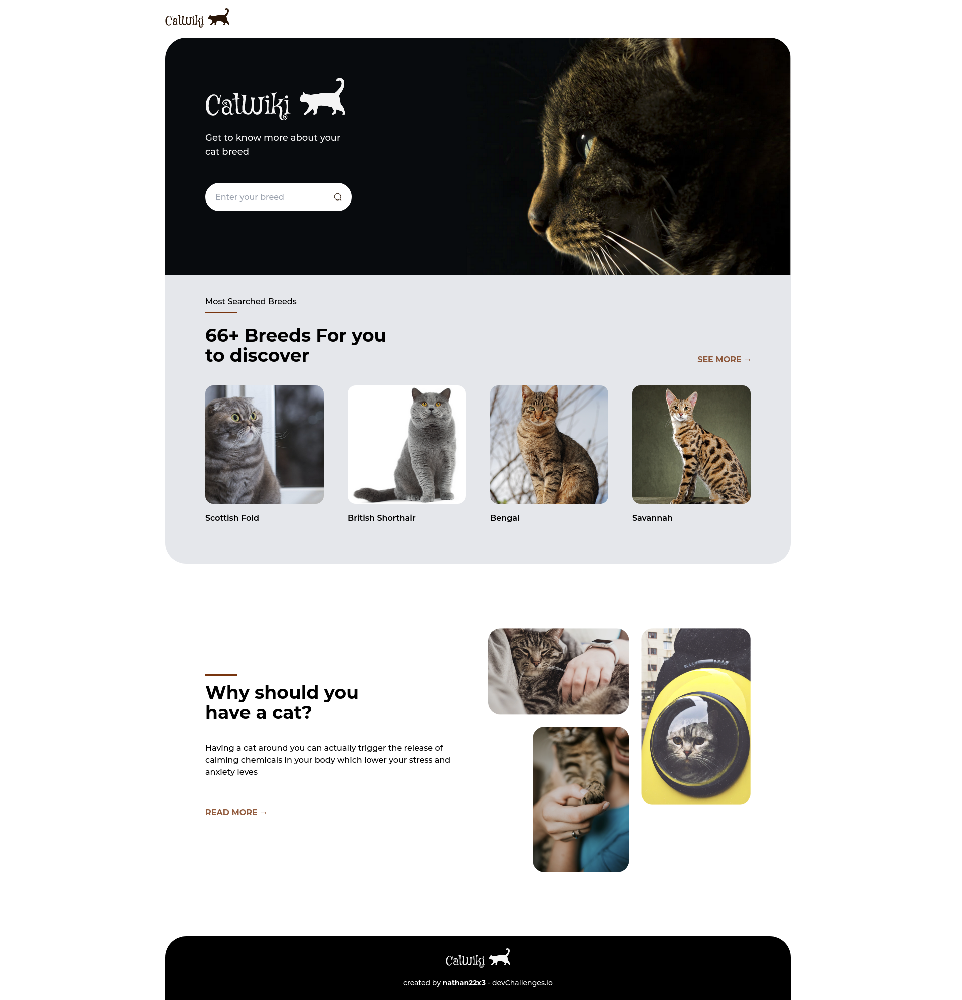

<!-- markdownlint-disable MD033 -->
<!-- markdownlint-disable MD041 -->

<div align="center">
  
</div>

<div align="center">
   Solution for a challenge from  <a href="http://devchallenges.io" target="_blank">Devchallenges.io</a>.
</div>

<div align="center">
  <h3>
    <a href="https://cat-wiki-nathan22x3.surge.sh">
      Demo
    </a>
    <span> | </span>
    <a href="https://devchallenges.io/solutions/P17crTRiwI9hY2LGPU7N">
      Solution
    </a>
    <span> | </span>
    <a href="https://devchallenges.io/challenges/f4NJ53rcfgrP6sBMD2jt">
      Challenge
    </a>
  </h3>
</div>

<!-- TABLE OF CONTENTS -->

## Table of Contents

- [Table of Contents](#table-of-contents)
- [Overview](#overview)
  - [Built With](#built-with)
- [Features](#features)
- [How To Use](#how-to-use)
- [Plugins](#plugins)
- [Contact](#contact)

<!-- OVERVIEW -->

## Overview



### Built With

- [React](https://reactjs.org/)
- [Tailwind](https://tailwindcss.com/)
- [Express.js](https://expressjs.com/)

## Features

This application/site was created as a submission to a [DevChallenges](https://devchallenges.io/challenges) challenge. The [challenge](https://devchallenges.io/challenges/mM1UIenRhK808W8qmLWv) was to build an application to complete the given user stories.

- [x] **User story**: You can search for cat breeds and select a breed of your choice
- [x] **User story**: You can see the most popular searched cat breeds summary on the homepage
- [x] **User story**: You can see the top 10 most searched cat breeds
- [x] **User story**: You can see the breed details including description, temperament, origin, life span, adaptability, affection level, child-friendly, grooming, intelligence, health issues, social needs, stranger friendly
- [x] **User story**: You can see more photo of the breed
- [x] **User story**: On mobile, when you select the search option, a modal for breed search should pop up
- [x] **User story**: You can go to the top 10 cats by clicking see more in the dashboard

## How To Use

<!-- Example: -->

To clone and run this application, you'll need [Git](https://git-scm.com) and [Node.js](https://nodejs.org/en/download/) (which comes with [npm](http://npmjs.com)) installed on your computer. From your command line:

```bash
# Clone this repository
$ git clone https://github.com/nathan22x3/cat-wiki

# Move to project directory
$ cd cat-wiki

# Install dependencies
$ yarn

# Run the app
$ yarn start
```

## Plugins

- [twin.macro](https://github.com/ben-rogerson/twin.macro)

## Contact

- GitHub [@nathan22x3](https://github.com/nathan22x3)
